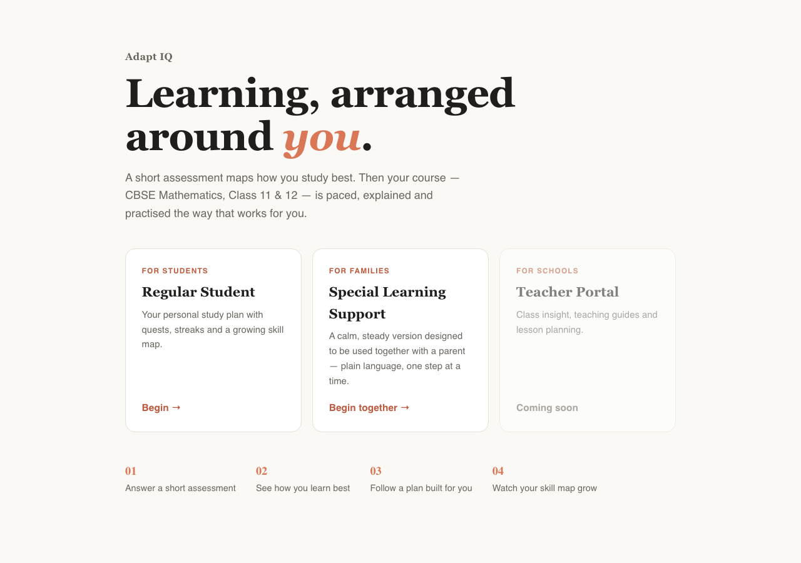
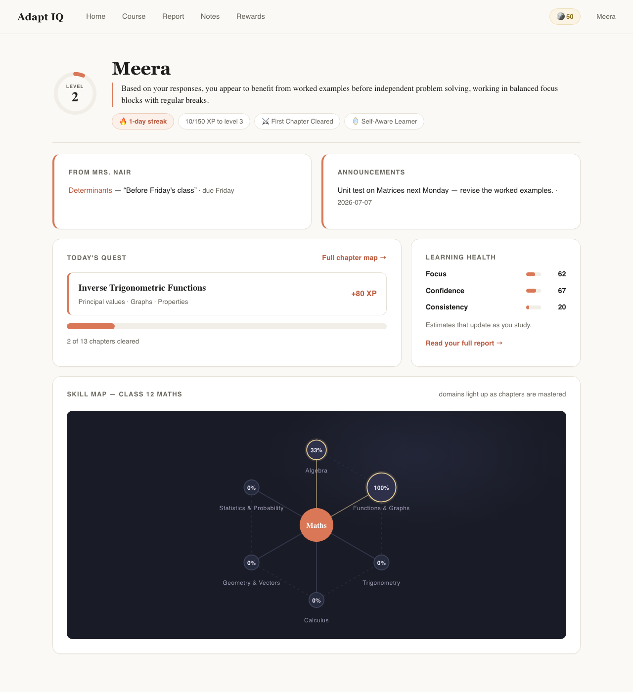
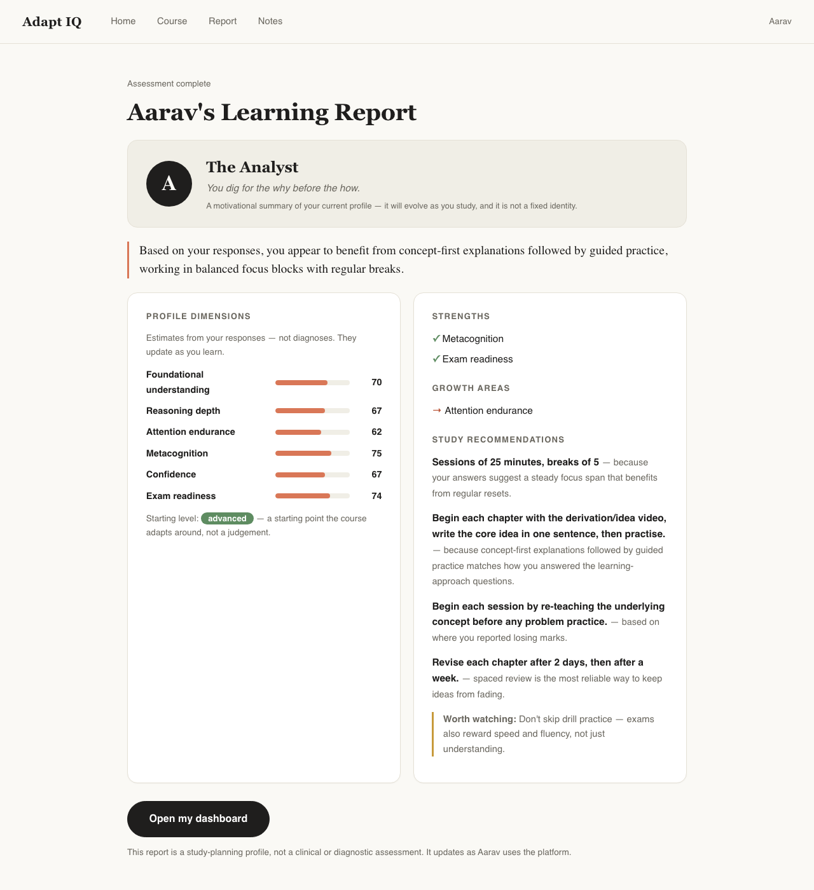
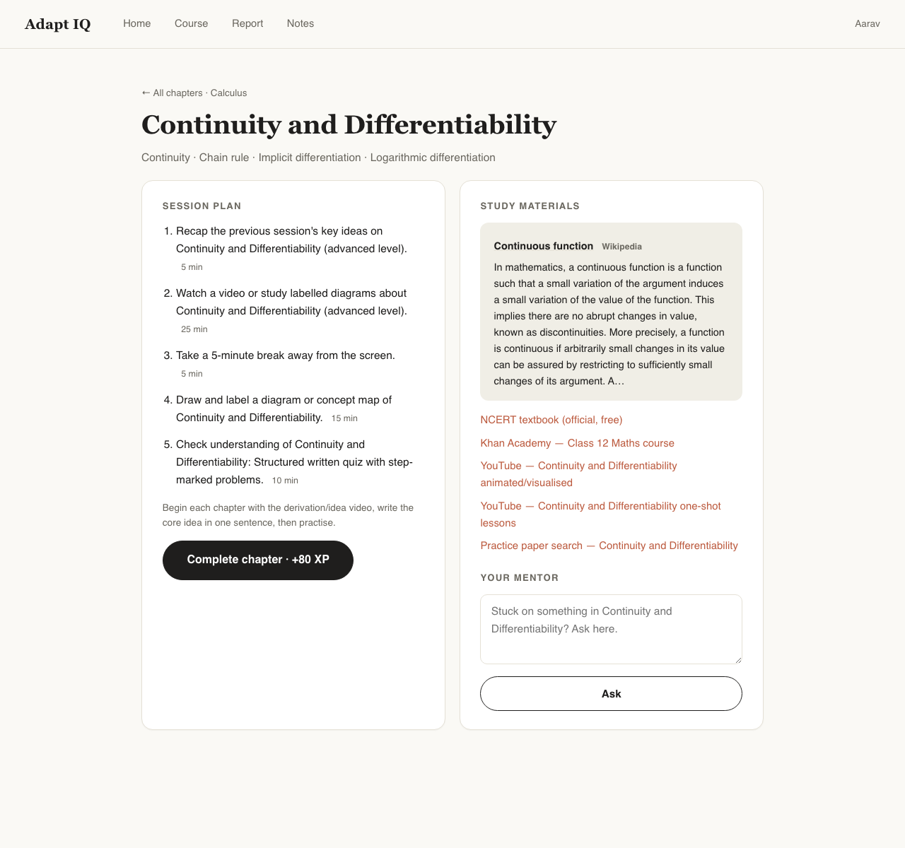
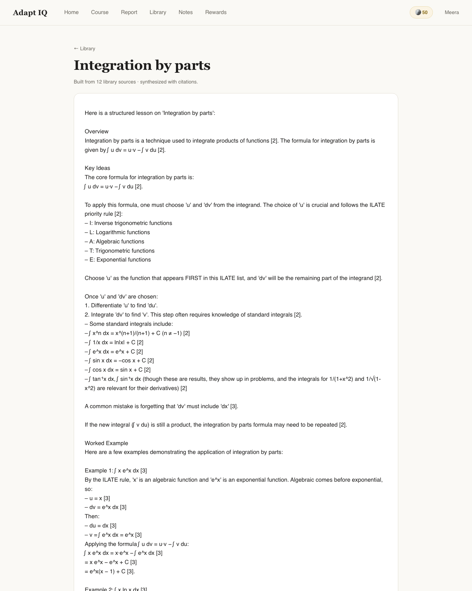
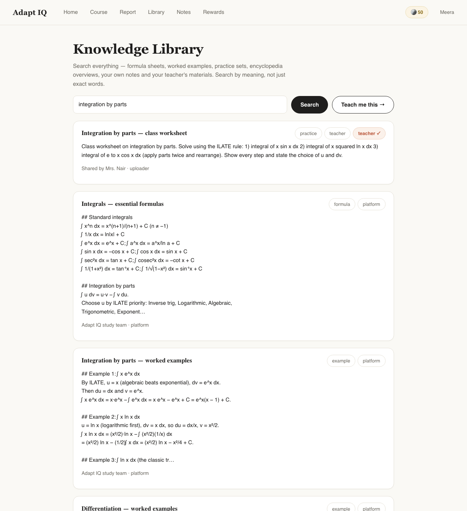
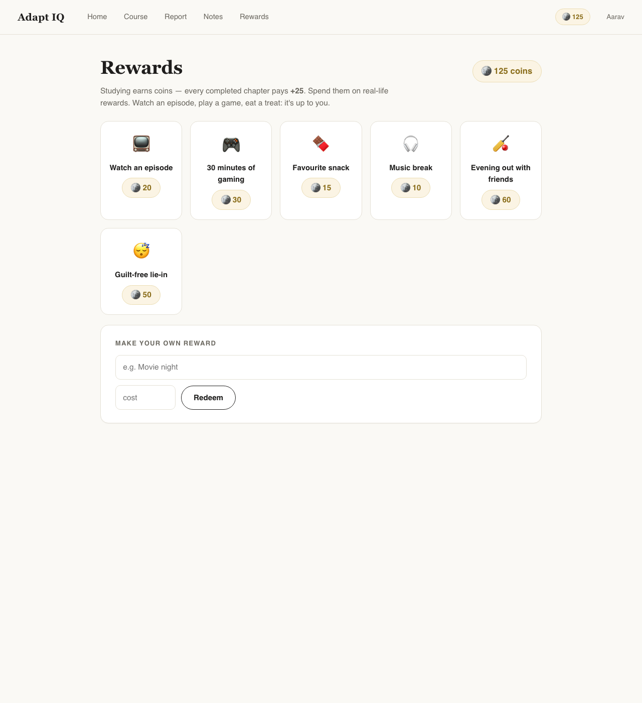
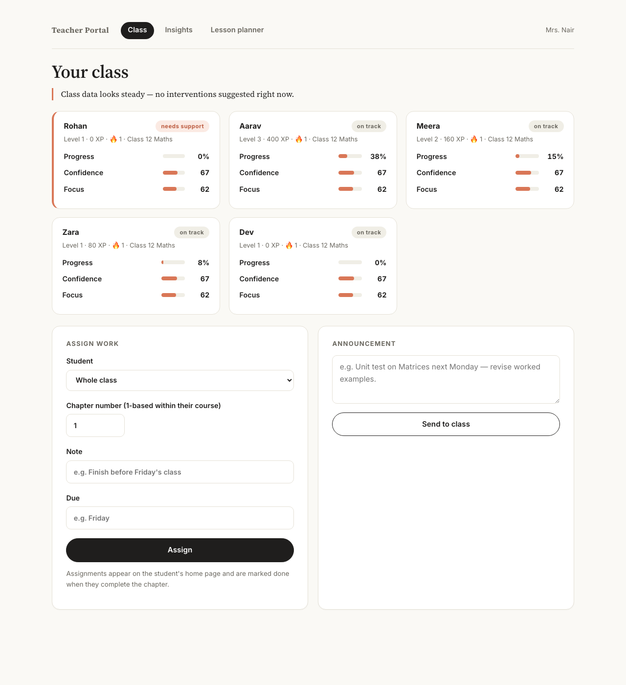
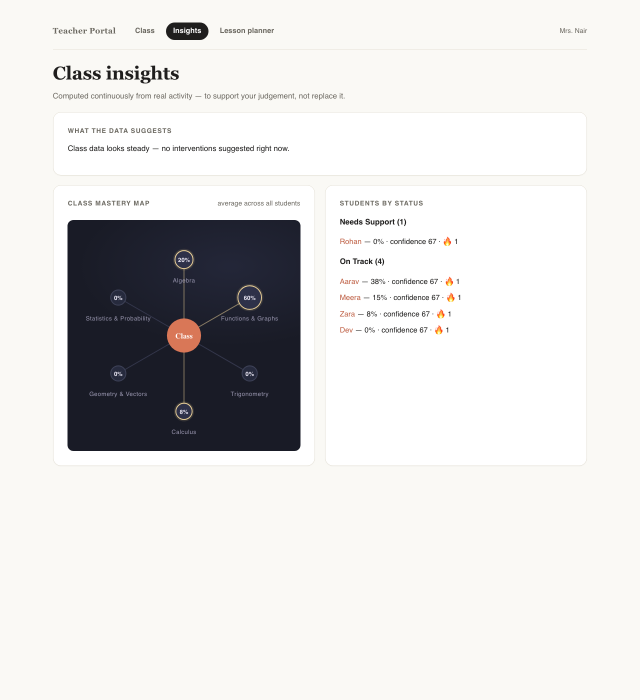
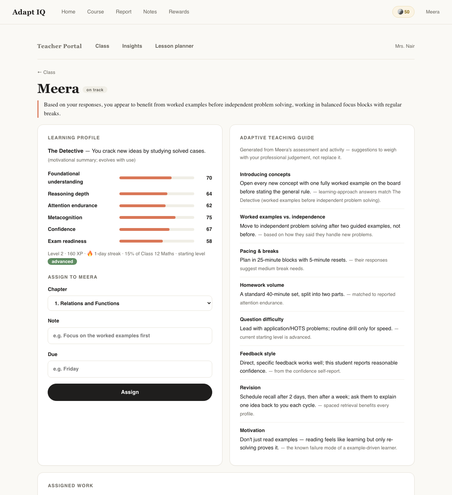

# ADAPT-IQ — Personalized Learning Platform

### CBSE Class 11 & 12 Mathematics · A learning platform that *first learns the learner*

<p align="center">
  
</p>

ADAPT-IQ is a self-serve e-learning platform built around a simple idea: before
it teaches you anything, it works out **how you learn best** — then paces,
explains and drills the CBSE Mathematics curriculum the way that actually
works for you. Progress is turned into a game (HP, XP, levels, streaks, badges,
a skill web that lights up as you master chapters), an AI mentor coaches you
Socratically instead of just handing over answers, and teachers get a live view
of the whole class.

---

## Table of contents

- [What makes it different](#what-makes-it-different)
- [Two modes, one curriculum](#two-modes-one-curriculum)
- [How it works](#how-it-works)
- [Screenshots](#screenshots)
- [The AI Mentor (Socratic, not a chatbot)](#the-ai-mentor-socratic-not-a-chatbot)
- [Quick start](#quick-start)
- [Daily use](#daily-use--start-everything-stop-everything)
- [Free AI setup](#free-ai-setup-step-by-step)
- [Deploying](#deploying-free-hosting)
- [Project structure](#project-structure)
- [Tech stack](#tech-stack)
- [Honest limits & assumptions](#honest-limits--assumptions)

---

## What makes it different

- 🧭 **It profiles the learner first.** A ~5-minute psychologist-style
  questionnaire (mixed multiple-choice + open subjective answers) is scored by
  an explicit rubric plus NLP, and a Decision Tree predicts a starting level.
- 🎮 **Studying feels like a game.** Every completed chapter awards real XP and
  coins, grows a live skill map, keeps a streak and unlocks badges.
- 🧑‍🏫 **The AI teaches, it doesn't tell.** The mentor guides one idea and one
  question at a time; the full worked solution only unlocks after genuine
  attempts.
- 🌐 **Live, free resources.** Each chapter pulls a real Wikipedia article
  (keyless, free API) plus NCERT / Khan Academy / YouTube / GeoGebra links
  matched to the learner's modality.
- 👩‍👩‍👧 **A calm mode for special-needs learners** working alongside a parent —
  plain language, one step at a time, guidance written for the parent.
- 🧑‍🏫 **A full Teacher Portal** — roster, class insights, lesson planner,
  assignments, announcements, AI-drafted quiz sets.
- 🔌 **Provider-agnostic AI** — one interface, seven interchangeable backends
  (Gemini, Groq, OpenRouter, Ollama and more), swappable from `.env` with no
  code changes, plus an automatic fallback when the primary is rate-limited.

---

## Two modes, one curriculum

On entry you make an **explicit choice** — the app never labels or infers
anything about the learner from their answers:

| Regular Mode | Specialized Mode |
| --- | --- |
| For students. A game-style journey: HP, XP, levels, streaks, badges, and a skill web that lights up as chapters are mastered. | For special-needs learners working **with a parent**: calm pages, plain language (reading age ≈ 8), one step at a time, and guidance boxes written for the parent helping alongside. |

Specialized Mode simplifies the **wording and pacing, never the curriculum**.

---

## How it works

1. **Onboarding** — name + course (launch course: Mathematics Class 11 or 12,
   CBSE/NCERT; more subjects slot in later).
2. **In-app questionnaire** (~5 min) — a psychologist-style instrument mixing
   direct multiple-choice and subjective open questions
   ([docs/questionnaire_and_scoring.md](docs/questionnaire_and_scoring.md)).
3. **Processing** — answers are scored by an explicit rubric + NLP (keyword
   coverage, TF-IDF, sentence complexity, sentiment); a **Decision Tree**
   predicts the starting level (basic / intermediate / advanced).
4. **Learner Report** — learner type (memorizer / example-driven /
   concept-first / visual / practice-driven), score bars, study rhythm
   (pacing, break schedule), strategy + "watch out" advice; parents get their
   own guidance section in Specialized Mode.
5. **Study** — the full NCERT chapter map per course. Every chapter page has a
   session plan personalized to the learner type, **live-pulled resources**, a
   mark-complete button that awards real XP and grows the skill web, and an
   **AI doubt box**.
6. **Notes** — paste/upload notes, get an extractive summary (works fully
   offline; AI-enhanced when a provider is configured).

---

## Screenshots

### Student home — profile, today's quest & a skill map that lights up

The home page greets the learner with their level, streak and badges, surfaces
teacher assignments and announcements, sets a "Today's Quest", and shows the
**skill map** where each maths domain fills in as chapters are mastered.

<p align="center">
  
</p>

### Learning Report — a study-planning profile, not a diagnosis

After the questionnaire, the learner gets a personalized report: a learner
archetype, profile-dimension bars (focus, confidence, exam readiness…),
strengths and growth areas, and concrete study recommendations — each with the
*why* behind it.

<p align="center">
  
</p>

### Chapter page — a personalized session plan + live study materials + AI mentor

Every chapter has a step-by-step session plan tuned to the learner type, a live
Wikipedia summary, curated NCERT / Khan Academy / YouTube / GeoGebra links, an
XP-earning "Complete chapter" button, and a mentor doubt box.

<p align="center">
  
</p>

### AI-built lesson — "Teach me this"

From the library, one click builds a cited, structured lesson on any topic.

<p align="center">
  
</p>

### Knowledge Library — search, "Teach me this", "Ask this document"

<p align="center">
  
</p>

### Rewards — turn study coins into real-life treats

Every completed chapter pays coins the learner can spend on their own rewards —
an episode, a game, a snack — or a reward they invent themselves.

<p align="center">
  
</p>

### Teacher Portal — roster, class insights & a class mastery map

Teachers get a live, computed view of the whole class — a class mastery map, a
"what the data suggests" panel, and students grouped by status (needs support /
on track) — framed to *support* the teacher's judgement, not replace it.

<p align="center">
  
</p>

<p align="center">
  
</p>

### Teacher → individual student view

<p align="center">
  
</p>

---

## The AI Mentor (Socratic, not a chatbot)

The AI behaves like a patient teacher, not an answer machine:

- **Mentor chat** (chapter page) — guides with one idea + one question per
  turn, never revealing the final answer. The complete worked solution unlocks
  only after the student has made real attempts AND explicitly asks for it.
  Adapts to the learner profile: low confidence → smaller steps and
  encouragement; strong conceptual reasoning → deeper questions and second
  methods; short attention span → concise replies with checkpoints.
- **Practice problems with a hint ladder** — fresh problem each time; four
  progressive hints (nudge → concept → method → partial working). Fewer hints =
  more XP (30 with none, 10 with all four; revealing the solution gives 5).
- **Micro-quizzes** — 6 mixed-type questions (MCQ, true/false, fill-in,
  numerical, short conceptual) generated per chapter. Difficulty adapts to
  recent scores; previously missed concepts reappear; earlier questions are
  never repeated. Every answer comes back with WHY, the concept tested and the
  common misconception — not just a mark.
- **Weekly revision quiz** (home page) — spaced repetition mixing the current
  topic, the oldest completed chapters and the most-missed concepts.
- **Teacher quiz sets** (Teacher Portal → Quizzes) — the AI drafts, the teacher
  reviews/edits/drops questions, approves, and assigns to a student or the
  class; results feed a per-concept performance view on each student's page.

---

## Quick start

```bash
python3 -m venv .venv && source .venv/bin/activate
pip install -r requirements.txt

python scripts/generate_synthetic_data.py   # training data for the model
python src/ml/train_model.py                # train + save the Decision Tree
python scripts/seed_library.py              # knowledge library starter content
python scripts/sync_sources.py              # NCERT + Wikipedia + DIKSHA (optional)
python -m src.dashboard.app                 # http://127.0.0.1:5050
pytest                                       # run the test suite
```

Then open **http://127.0.0.1:5050** and pick *Regular Student*, *Special
Learning Support*, or *Teacher Portal*.

---

## Daily use — start everything, stop everything

### Starting up (every time)

1. **Open Terminal** and go to the project folder, then **activate the Python
   environment** (the prompt gains a `(.venv)` prefix):
   ```bash
   cd "/path/to/Adapt IQ"
   source .venv/bin/activate
   ```
2. **Start the app** — leave this terminal open, it IS the server:
   ```bash
   python -m src.dashboard.app
   ```
   It prints `Running on http://127.0.0.1:5050`.
3. **Open the app** at http://127.0.0.1:5050.

First time on a machine only: run the [Quick start](#quick-start) block first.

### Optional maintenance commands

```bash
python scripts/seed_library.py        # rebuild the starter library (wipes library.db)
python scripts/sync_sources.py        # refresh NCERT/Wikipedia/DIKSHA (idempotent)
python scripts/sync_sources.py ncert --limit 5   # just a few NCERT chapters
pytest                                # run the full test suite
```

### Shutting down

1. In the server terminal press **Ctrl + C** — Flask stops.
2. If you lost that terminal:
   ```bash
   pkill -f src.dashboard.app          # stop the server
   lsof -i :5050                       # verify: no output = port free
   deactivate                          # leave the Python environment
   ```

Nothing is lost on shutdown: students, teachers, progress, uploads and the
knowledge library all live in `data/` and are picked up on the next start.

---

## Free AI setup (step by step)

AI powers the mentor, quizzes and doubt solving. The app is **fully functional
without it** and says so honestly. The AI layer is provider-agnostic by design
(`src/ai_integration/ai_client.py`): one interface, seven interchangeable
backends, switchable in `.env` without touching any application code, plus an
automatic fallback provider (`AI_FALLBACK_PROVIDER`) when the primary is
rate-limited. Pick **one** provider:

**A — Google Gemini** (easiest; free tier, no credit card):
https://aistudio.google.com/apikey → Create API key → in `.env`:
`AI_PROVIDER=gemini`, `AI_API_KEY=<key>`.

**B — Ollama** (structurally free forever; local, no key, offline): install
from https://ollama.com → `ollama pull llama3.2` → in `.env`:
`AI_PROVIDER=ollama`.

**C — Groq** (https://console.groq.com/keys) or **D — OpenRouter free models**
(https://openrouter.ai/keys) — same two-line `.env` change.

All providers are called over plain HTTPS; in Specialized Mode the AI is
instructed to answer in short, literal, simple sentences.

> Copy `.env.example` to `.env` and fill in your provider. The `.env` file is
> gitignored and never committed.

---

## Deploying (free hosting)

Ships with `gunicorn` + `Procfile`. On **Render** (free tier): connect the
GitHub repo →
- **Build:** `pip install -r requirements.txt && python scripts/generate_synthetic_data.py && python src/ml/train_model.py`
- **Start:** `gunicorn 'src.dashboard.app:create_app()' --bind 0.0.0.0:$PORT`
- add `AI_PROVIDER` / `AI_API_KEY` env vars.

Note: user profiles persist to `data/users.json`; on ephemeral free hosts
attach a disk or swap in a database.

---

## Project structure

```
├── config.py                          # env switches (AI provider, live resources)
├── Procfile                           # gunicorn entrypoint
├── requirements.txt
├── docs/
│   ├── questionnaire_and_scoring.md   # full instrument + rubric
│   ├── content_architecture.md
│   └── screenshots/                   # images used in this README
├── scripts/
│   ├── generate_synthetic_data.py     # model training data
│   ├── seed_library.py                # knowledge library starter content
│   └── sync_sources.py                # NCERT + Wikipedia + DIKSHA sync
├── src/
│   ├── preprocessing/                 # rubric, NLP, feature engineering
│   ├── ml/                            # Decision Tree train/predict
│   ├── rules_engine/                  # learner-method strategies, session plans
│   ├── curriculum/cbse_math.py        # NCERT 11/12 chapter map + resources
│   ├── resources/finder.py            # live Wikipedia fetch (keyless, free)
│   ├── notes/summarizer.py            # offline extractive summarizer
│   ├── library/                       # knowledge library + document Q&A
│   ├── ai_integration/                # gemini/groq/openrouter/ollama + fallback
│   └── dashboard/                     # Flask app, user store, templates, themes
└── tests/                             # pytest suite
```

---

## Tech stack

- **Backend:** Python, Flask, gunicorn
- **ML:** scikit-learn Decision Tree, TF-IDF / NLP feature engineering
- **AI:** provider-agnostic client (Gemini, Groq, OpenRouter, Ollama, …) with
  automatic fallback
- **Data:** JSON user store + SQLite knowledge library
- **Frontend:** server-rendered Jinja templates, hand-written CSS
- **Live content:** keyless Wikipedia / Simple-English-Wikipedia API

---

## Honest limits & assumptions

- The questionnaire/rubric is a **heuristic planning instrument, not a clinical
  assessment**; learning-style theory is contested and modality is used as a
  format preference only.
- The Decision Tree is trained on **synthetic** questionnaire data (held-out
  accuracy 0.764 / macro-F1 0.780 — synthetic-data numbers only); real user
  data should replace it over time.
- Scoring thresholds (keyword points, pace/break buckets 0.7/1.4, XP values,
  level curve) are documented design decisions.
- Resource links: the Wikipedia article is fetched live; other materials are
  curated search/portal links (NCERT, Khan Academy, YouTube, GeoGebra) — a
  vetted per-chapter content library is the natural next step.
- One course at launch (Maths 11/12 CBSE) by design; the curriculum module is
  shaped so more courses/subjects drop in as data files.
- Cloud AI providers are implemented and ready but untested against live keys;
  Ollama is locally testable by anyone.
